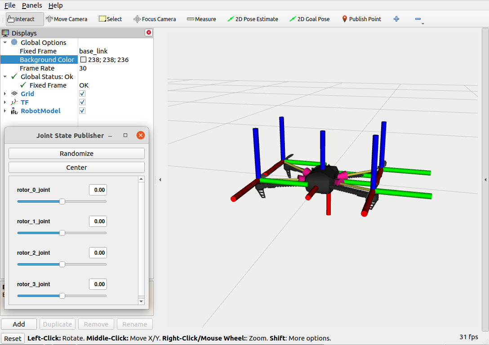

# iris_description

Theis package provides the description and configuration of the Iris drone using a URDF (Unified Robot Description Format) model. This package enables the integration of the drone in ROS 2 for visualization in RViz, trajectory tracking, sensor fusion, and navigation algorithm development.



---

## Installation

### 1. Clone the repository
Run the following commands to clone the repository into your ROS 2 workspace:

```bash
cd px4_ws/src
git clone https://github.com/FredMSaico/iris_description
```

### 2. Build the package
Build the package using `colcon`:

```bash
colcon build --packages-select iris_description
```

---

## Execution

### Load the model in simulation
To load the Iris drone model into the simulation, use the following command:

```bash
ros2 launch iris_description iris_model.launch.py
```

---

## License

This package is licensed under the [GPL-3.0 License](LICENSE).
